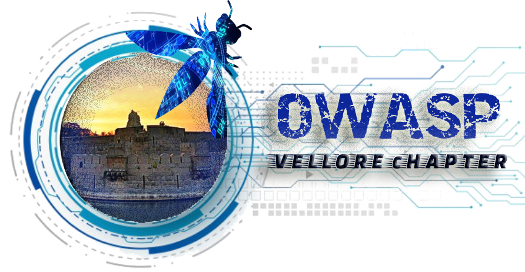

## Welcome

Welcome to the Vellore chapter homepage. The Open Web Application Security Project (OWASP) is a nonprofit foundation that works to improve the security of software. All of our projects ,tools, documents, forums, and chapters are free and open to anyone interested in improving application security. The chapter leaders are Vijay S, K R Shankar. The chapter presents opportunities to the software community in contributing to secure application development.

## Participation
The Open Web Application Security Project (OWASP) is a nonprofit foundation that works to improve the security of software. All of our projects ,tools, documents, forums, and chapters are free and open to anyone interested in improving application security. 

Chapters are led by local leaders in accordance with the [Chapter Leader Handbook](/www-policy/rules-of-procedure/chapter-handbook). Financial contributions should only be made online using the authorized online donation button. To be a SPEAKER at ANY OWASP Chapter in the world simply review the [speaker agreement](/www-policy/speaker-agreement) and then contact the local chapter leader with details of what OWASP Project, independent research, or related software security topic you would like to present.

Everyone is welcome and encouraged to participate in our [Projects](https://owasp.org/projects/), [Local Chapters](/chapters), [Events](https://owasp.org/events/), [Online Groups](https://groups.google.com/a/owasp.com/). We especially encourage diversity in all our initiatives. OWASP is a fantastic place to learn about application security, to network, and even to build your reputation as an expert. We also encourage you to be [become a member](https://owasp.org/membership/) or consider a [donation](https://owasp.org/donate/?reponame=www-chapter-vellore&title=OWASP+Vellore) to support our ongoing work.

## Call for Speakers

Would you like to speak on the upcoming OWASP Vellore Webinar? [Contact Us](mailto:vijay.s@owasp.org)

**Email Format :**

- Speaker name
- Job Role
- Company / Organization
- Country
- Email ID
- Contact Number
- Speaker Profile
- Presentation Details
    - Name / Title of the Presentation
    - Abstract of the presentation
    - Presentation time required

## Local News

- Linux Forensics OCT 18 2020.
- Zoho meeting link - https://us04web.zoom.us/j/75955738906?pwd=N0U3U0RiREVJeEZnV0tielpoUE1wdz09

-The meets are free for anyone to attend. There are absolutely no fees. Just come with an open mind and a willingness to share and learn.

Stay Tuned for new updates..

