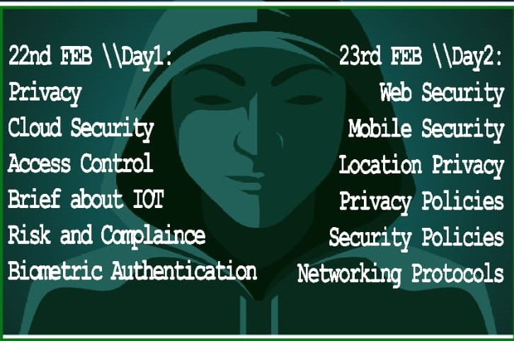

## Past Events

```Stay in touch with us to get updates about upcoming meetings!!!```

<hr>

## OWASP Vellore Chapter - Seminar - 22nd and 23rd Feb, 2020

**Agenda**




**Venue**

VIT, Vellore Campus, Tiruvalam Rd, Katpadi, Vellore, Tamil Nadu 632014


<hr>

## OWASP Vellore Chapter - Seminar - 18 Dec, 2019

**Agenda**
```
 - 09:30a.m – 10.00a.m => Meetup starts
 - 10:00a.m – 11.00a.m => OWASP IOT Top 10 - Vijay S, OWASP Vellore
 - 11.00a.m - 11.15a.m => Break
 - 11:15a.m – 11.45a.m => Session Hijacking with Advanced Cross Site Scripting attacks - Guhan Raja
 - 11:45a.m – 12:30p.m => Essential of Recon  - Surya
 - 12:30p.m – 12:45p.m => Meetup ends
```

**Venue**

Sakthi Infotech, Kaniyambadi, Vellore Tamil Nadu 632102

<hr>

## OWASP Vellore Chapter - Seminar - 15 Nov, 2019

**Agenda**
```
` 9:30p.m – 11.45 a.m => SSRF & Command injection :-`**`Vijay.S`**`                    `
```
**Venue**

Sakthi Infotech, Kaniyambadi, Vellore Tamil Nadu 632102

<hr>

## OWASP Vellore Chapter - Seminar - 24 Sep, 2019

**Agenda**
```
` 2:00p.m – 3.00p.m => Website security and Ethical Hacking :-`**`Vijay.S`**`                    `
```
**Venue**

TNEB HQ Tamil Nadu 632102

Special Thanks to **TNEB Team**

<hr>

## OWASP Vellore Chapter - Seminar - 24 Aug, 2019

**Agenda**
```
` 11:00a.m – 1.00p.m => OWASP Serverless Top 10 by Vijay`
`                    => `<B>`IPSec Management Demo `</B>`Vijay 09:00a.m – 10.00a.m `
` 01:00p.m – 02.00p.m => Introduction to Python Sandbox escaping`

```
### **Venue**

Hindustan University

<hr>

## OWASP Vellore Chapter - Seminar - 24 July, 2019
**Agenda**
```
` 11:00a.m – 1.00p.m => `<B>`Basic concepts of Networks Scanning`</B>
`                    => `<B>`Web Application Demo `</B>`Shankar Narayanan,Vijay`
```
### **Venue**

M Academy, Vellore Tamil Nadu 632102

<hr>

## OWASP Vellore Chapter Meetup - 9th May, 2019
**Agenda**
```
` 09:00a.m – 10.00a.m => `<B>`Introduction to Ethical Hacking`</B><br/>
` 10:00a.m – 01.00p.m => `<B>`SSRF Demo - Vijay.S`</B><br/>
` 01.00p.m - 02.15p.m => Break`<br/>
` 02:15p.m – 03.15p.m => `**`Cyber``   ``Law-``   ``Shankar``  ``Narayanan,`**` `<br/>
` 03.15p.m – 04:00p.m => `<B>`End of session -Pachai, SBCEC.`</B><br/>
```
### **Venue**

Sakthi Infotech, Arni Road, Kaniyambadi, Vellore Tamil Nadu 632102

<hr>

## OWASP Vellore Chapter Meetup - 3rd February, 2019
**Agenda**
```
` 09:00a.m – 10.00a.m => `<B>`Introduction to OWASP`</B> <br/>
` 10:00a.m – 01.00p.m => `<B>`Exploitation of WebApplication - Vijay.S`</B> <br/>
` 01.00p.m - 02.15p.m => Break` <br/>
` 02:15p.m – 03.15p.m => `**`HID``   ``Attacks``   ``-``   ``Shankar`` ``Narayanan,`**` ` <br/>
` 03.15p.m – 04:00p.m => `<B>`Bug Bounty Hunting : for Starters  -`</B> <br/>
` 04:00p.m – 04:15p.m => `<B>`End of Meetup`</B><br/> 
```
**Venue**

Sakthi Infotech, Arni Road, Kaniyambadi, Vellore Tamil Nadu 632102,

<hr>

For any queries, Please reach us at 6369649417

<hr>

